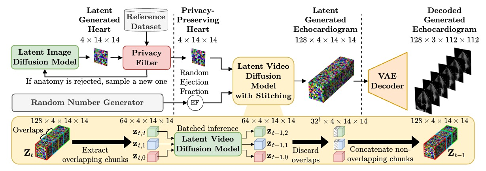
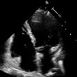
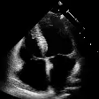

*Model weights and synthetic datasets coming soon !*

# EchoNet-Synthetic

## Introduction

This repository contains the code for the paper [EchoNet-Synthetic: Privacy-preserving Video Generation for Safe Medical Data Sharing](#). Hadrien Reynaud, Qingjie Meng, Mischa Dombrowski, Arijit Ghosh, Alberto Gomez, Paul Leeson and Bernhard Kainz. (2024) MICCAI 24.

EchoNet-Synthetic presents a protocol to generate surrogate privacy-compliant datasets that are as valuable as their original counterparts to train downstream models (e.g. regression models).

In this repository, we present the code we use for the experiments in the paper. We provide the code to train the models, generate the synthetic data, and evaluate the quality of the synthetic data.
We also provide all the pre-trained models and release the synthetic datasets we generated.


*Exemple of synthetic videos generated with EchoNet-Synthetic. First Video is real, others are generated.*

## Table of contents
1. [Environment setup](#environment-setup)
2. [Data preparation](#data-preparation)
3. [The models](#the-models)
4. [Generating EchoNet-Synthetic](#generating-echonet-synthetic)
5. [Evaluation](#evaluation)
6. [Results](#results)
7. [Citation](#citation)

## Environment setup
<!-- <details open id="environment-setup">
<summary style="font-size: 1.5em; font-weight: bold;" >Environment setup<hr></summary> -->

First, we need to set up the environment. We use the following command to create a new conda environment with the required dependencies.

```bash
conda create -y -n echosyn python=3.11
conda activate echosyn
pip install -e .
```
*Note: the exact version of each package can be found in requirements.txt if necessary*

This repository lets you train three models: 
- the Latent Image Diffusion Model (LIDM)
- the Re-Indentification models for privacy checks
- the Latent Video Diffusion Model (LVDM)

We rely on external libraries to:
- train the Variational Auto-Encoder (VAE) (Stable-Diffusion and Taming-Transformers)
- evaluate the generated images and videos (StyleGAN-V)
- evaluate the synthetic data on the Ejection Fraction downstream task (EchoNet-Dynamic)

How to install the external libraries is explained in the [External libraries](external/README.md) section.


<!-- </details> -->

## Data preparation
<!-- <details open id="data-preparation">
<summary style="font-size: 1.5em; font-weight: bold;">Data preparation<hr></summary> -->

### ➡ Original datasets
Download the EchoNet-Dynamic dataset from [here](https://echonet.github.io/dynamic/) and the EchoNet-Pediatric dataset from [here](https://echonet.github.io/pediatric/). The datasets are available for free upon request. Once downloaded, extract the content of the archive in the `datasets` folder. For simplicity and consistency, we structure them like so:
```
datasets
├── EchoNet-Dynamic
│   ├── Videos
│   ├── FileList.csv
│   └── VolumeTracings.csv
└── EchoNet-Pediatric
    ├── A4C
    │   ├── Videos
    │   ├── FileList.csv
    │   └── VolumeTracings.csv
    └── PSAX
        ├── Videos
        ├── FileList.csv
        └── VolumeTracings.csv
```

To harmonize the datasets, we add some information to the `FileList.csv` files of the EchoNet-Pediatric dataset, namely FrameHeight, FrameWidth, FPS, NumberOfFrames. We also arbitrarily set the splits from the 10-fold indices to a simple TRAIN/VAL/TEST split. These updates ares applied with the following command:

```bash
python scripts/complete_pediatrics_filelist.py --dataset datasets/EchoNet-Pediatric/A4C
python scripts/complete_pediatrics_filelist.py --dataset datasets/EchoNet-Pediatric/PSAX
```

This is crucial for the other scripts to work properly.

### ➡ Image datasets for VAE training
See the [VAE training](echosyn/vae/README.md) section To see how to train the VAE.

The VAE needs images only and to keep things simple, we format our video datasets into image datasets.
We do that with:
```bash
bash scripts/extract_frames_from_videos.sh datasets/EchoNet-Dynamic/Videos data/vae_train_images/images/
bash scripts/extract_frames_from_videos.sh datasets/EchoNet-Pediatric/A4C/Videos data/vae_train_images/images/
bash scripts/extract_frames_from_videos.sh datasets/EchoNet-Pediatric/PSAX/Videos data/vae_train_images/images/
```

Note that this will merge all the images in the same folder.

Then, we need to create train.txt file and a val.txt file containing the path to these images.
```bash
find $(cd data/vae_train_images/images && pwd) -type f | shuf > tmp.txt
head -n -1000 tmp.txt > data/vae_train_images/train.txt
tail -n 1000 tmp.txt > data/vae_train_images/val.txt
rm tmp.txt
```

### ➡ Latent Video datasets for LIDM / Privacy / LVDM training

The LIDM, Re-Identification model and LVDM are trained on pre-encoded latent representations of the videos. To encode the videos, we use the image VAE. You can either retrain the VAE or download it from [here](https://link). Once you have the VAE, you can encode the videos with the following command:

```bash
# For the EchoNet-Dynamic dataset
python scripts/encode_video_dataset.py \
    --model models/vae \
    --input datasets/EchoNet-Dynamic \
    --output data/latents/dynamic \
    --gray_scale
```
```bash
# For the EchoNet-Pediatric datasets
python scripts/encode_video_dataset.py \
    --model models/vae \
    --input datasets/EchoNet-Pediatric/A4C \
    --output data/latents/ped_a4c \
    --gray_scale

python scripts/encode_video_dataset.py \
    --model models/vae \
    --input datasets/EchoNet-Pediatric/PSAX \
    --output data/latents/ped_psax \
    --gray_scale
```

### ➡ Validation datasets

To quantitatively evaluate the quality of the generated images and videos, we use the StyleGAN-V repo.
We cover the evaluation process in the [Evaluation](#evaluation) section.
To enable this evaluation, we need to prepare the validation datasets. We do that with the following command:

```bash
python scripts/create_reference_dataset.py --dataset datasets/EchoNet-Dynamic --output data/reference/dynamic --frames 128
```

```bash
python scripts/create_reference_dataset.py --dataset datasets/EchoNet-Pediatric/A4C --output data/reference/ped_a4c --frames 16
```

```bash
python scripts/create_reference_dataset.py --dataset datasets/EchoNet-Pediatric/PSAX --output data/reference/ped_psax --frames 16
```

Note that the Pediatric datasets do not support 128 frames, preventing the computation of FVD_128, because there are not enough videos lasting more 4 seconds or more. We therefore only extract 16 frames per video for these datasets.

</details>

## The Models
<!-- <details open id="models">
<summary style="font-size: 1.5em; font-weight: bold;">The models<hr></summary> -->



*Our pipeline, using all our models: LIDM, Re-Identification (Privacy), LVDM and VAE*


### The VAE

You can download the pretrained VAE from [here](https://link) or train it yourself by following the instructions in the [VAE training](echosyn/vae/README.md) section.

### The LIDM

You can download the pretrained LIDMs from [here](https://link) or train them yourself by following the instructions in the [LIDM training](echosyn/lidm/README.md) section.

### The Re-Identification models

You can download the pretrained Re-Identification models from [here](https://link) or train them yourself by following the instructions in the [Re-Identification training](echosyn/privacy/README.md) section.

### The LVDM

You can download the pretrained LVDM from [here](https://link) or train it yourself by following the instructions in the [LVDM training](echosyn/lvdm/README.md) section.

### Structure

The models should be structured as follows:
```
models
├── lidm_dynamic
├── lidm_ped_a4c
├── lidm_ped_psax
├── lvdm
├── regression_dynamic
├── regression_ped_a4c
├── regression_ped_psax
├── reidentification_dynamic
├── reidentification_ped_a4c
├── reidentification_ped_psax
└── vae
```

<!-- </details> -->

## Generating EchoNet-Synthetic
<!-- <details open id="echonet-synthetic">
<summary style="font-size: 1.5em; font-weight: bold;">Generating EchoNet-Synthetic<hr></summary> -->

Now that we have all the necessary models, we can generate the synthetic datasets. The process is the same for all three datasets and involves the following steps:
- Generate a collection of latent heart images with the LIDMs (usually 2x the amount of videos we are targetting)
- Apply the privacy check, which will filter out some of the latent images
- Generate the videos with the LVDM, and decode them with the VAE

#### Dynamic dataset
For the dynamic dataset, we aim for 10,030 videos, so we start by generating 20,000 latent images:
```bash
python echosyn/lidm/sample.py \
    --config models/lidm_dynamic/config.yaml \
    --unet models/lidm_dynamic \
    --vae models/vae \
    --output samples/synthetic/lidm_dynamic \
    --num_samples 20000 \
    --batch_size 128 \
    --num_steps 64 \
    --save_latent \
    --seed 0
```

Then, we filter the latent images with the re-identification model:
```bash
python echosyn/privacy/apply.py \
    --model models/reidentification_dynamic \
    --synthetic samples/synthetic/lidm_dynamic/latents \
    --reference data/latents/dynamic \
    --output samples/synthetic/lidm_dynamic/privatised_latents
```

We generate the synthetic videos with the LVDM:
```bash
python echosyn/lvdm/sample.py \
    --config models/lvdm/config.yaml \
    --unet models/lvdm \
    --vae models/vae \
    --conditioning samples/synthetic/lidm_dynamic/privatised_latents \
    --output samples/synthetic/lvdm_dynamic \
    --num_samples 10030 \
    --batch_size 8 \
    --num_steps 64 \
    --min_lvef 10 \
    --max_lvef 90 \
    --save_as avi \
    --frames 192
```

Finally, update the content of the FileList.csv to respect the right amount of videos in each split, and the correct naming convention.
```bash
mkdir -p datasets/EchoNet-Synthetic/dynamic
mv samples/synthetic/lvdm_dynamic/avi datasets/EchoNet-Synthetic/dynamic/Videos
cp samples/synthetic/lvdm_dynamic/FileList.csv datasets/EchoNet-Synthetic/dynamic/FileList.csv
python scripts/update_split_filelist.py --csv datasets/EchoNet-Synthetic/dynamic/FileList.csv --train 7465 --val 1288 --test 1277
```

You can use the exact same process for the Pediatric datasets, just make sure to use the right models.
The A4C dataset should have 3284 videos, with 2580 train, 336 validation and 368 test videos.
3559 448 519
The PSAX dataset should have 4526 videos, with 3559 train, 448 validation and 519 test videos.
They also have a different number of frames per video, which is 128 insted of 192.

<!-- </details> -->

## Evaluation
<!-- <details open id="evaluation">
<summary style="font-size: 1.5em; font-weight: bold;">Evaluation<hr></summary> -->

As the final step, we evaluate the quality of EchoNet-Synthetic videos by training a Ejection Fraction regression model on the synthetic data and evaluating it on the real data.
To do so, we use the EchoNet-Dynamic repository. 
You will need to clone a slightly modifier version of the repository from [here](https://github.com/HReynaud/echonet), and put it in the `external` folder.

Once that is done, you will need to switch environment to the echonet one.
To create the echonet environment, you can use the following command:
```bash
cd external/echonet
conda create -y -n echonet python=3.10
conda activate echonet
pip install -e .
```

Then, you should double check that everything is working by reproducing the results of the EchoNet-Dynamic repository on the real EchoNet-Dynamic dataset. This should take ~12 hours on a single GPU.
```bash
echonet video --data_dir ../../datasets/EchoNet-Dynamic \
        --output ../../experiments/regression_echonet_dynamic \
        --pretrained \
        --run_test \
        --num_epochs 45
```

Once you have confirmed that everything is working, you can train the same model on the synthetic data, while evaluating on the real data.
```bash
echonet video --data_dir ../../datasets/EchoNet-Synthetic/dynamic \
        --data_dir_real ../../datasets/EchoNet-Dynamic \
        --output ../../experiments/regression_echosyn_dynamic \
        --pretrained \
        --run_test \
        --num_epochs 45 \
        --period 1
```

This will automatically compute the final metrics after training, and store them in the `experiments/regression_echosyn_dynamic/log.csv` folder.

The process is the same for the Pediatric datasets, although they start from a pretrained model, trained on the real EchoNet-Dynamic data, which would look like this:
```bash
echonet video --data_dir ../../datasets/EchoNet-Pediatric/A4C \
        --data_dir_real ../../datasets/EchoNet-Pediatric/A4C \
        --output ../../experiments/regression_echosyn_peda4c \
        --weights ../../experiments/regression_real/best.pt \
        --run_test \
        --num_epochs 45 \
        --period 1
```

<!-- Improving EchoNet-Synthetic -->
Here are two tricks that can improve the quality and alignment of the synthetic data with the real data:
- Re-label the synthetic data with the regression model trained on the real data.
- Use the Ejection Fraction scores from the real dataset to create the synthetic dataset, not uniformaly distributed ones.

</details>

## Results
<!-- <details open id="results">
<summary style="font-size: 1.5em; font-weight: bold;">Results<hr></summary> -->

<p>Here is a side by side comparison between a real video and a synthetic video generated with EchoNet-Synthetic. We use a frame from the real video and its corresponding ejected fraction score to "reproduce" the real video.</p>

<table style="width:auto; border:1px solid black; text-align:center;">
    <tr>
        <th style="padding:10px; border:1px solid black;">Real Video</th>
        <th style="padding:10px; border:1px solid black;">Reproduction</th>
    </tr>
    <tr>
        <td style="padding:10px; border:1px solid black;"></td>
        <td style="padding:10px; border:1px solid black;"></td>
    </tr>
</table>

<p>Here we show a collection of synthetic videos generated with EchoNet-Synthetic. We can see that the quality of the videos is excellent, and show a variety of ejection fraction scores.</p>


<!-- </details> -->

<!-- ## Citation -->
## Citation

```
@article{reynaud2024echonet,
  title={EchoNet-Synthetic: Privacy-preserving Video Generation for Safe Medical Data Sharing},
  author={Reynaud, Hadrien and Meng, Qingjie and Dombrowski, Mischa and Ghosh, Arijit and Day, Thomas and Gomez, Alberto and Leeson, Paul and Kainz, Bernhard},
  journal={arXiv preprint arXiv:2406.00808},
  year={2024}
}
```
